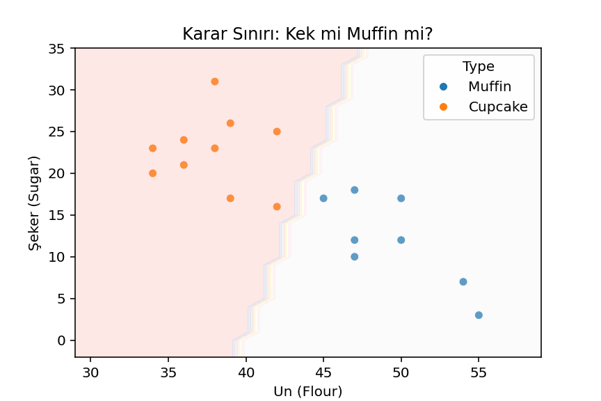

# 🧁 Kek mi Muffin mi?

Bu projede, un (Flour) ve şeker (Sugar) oranlarına göre bir ürünün kek mi yoksa muffin mi olduğunu tahmin eden basit bir **lojistik regresyon modeli** geliştirilmiştir.

## Veri Seti

- **Flour**: Un miktarı
- **Sugar**: Şeker miktarı
- **Type**: Ürünün türü (`Cupcake` veya `Muffin`)

## Kullanılan kutuphaneler

- Python
- pandas, numpy
- matplotlib, seaborn
- scikit-learn
- pickle

### 1. Veri Yükleme ve İnceleme
- Veri `pandas` ile yüklendi ve ilk birkaç satır incelendi.
- `Type` sütunundaki kek ve muffin sayısı kontrol edildi.

### 2. Özellik ve Etiket Ayrımı
- Model için giriş verileri `Flour` ve `Sugar` sütunları olarak alındı.
- Hedef değişken (etiket) `Type` sütunundan elde edildi.

### 3. Etiket Kodlama
- `LabelEncoder` ile kategorik veriler sayıya çevrildi.

### 4. Model Eğitimi
- `LogisticRegression` modeli oluşturulup verilerle eğitildi.

### 5. Tahmin Yapma
- Yeni bir veri girilerek modelin tahmini alındı.

### 6. Karar Sınırının Görselleştirilmesi
- Scatter plot ile ürünlerin dağılımı gösterildi.
- Lojistik regresyon modelinin karar sınırı çizildi.

### 7. Model Kaydetme
- Eğitilen model ve etiketleyici `.pkl` dosyasına kaydedildi.

### 8. Model Yükleyip Kullanma
- Kaydedilen model yeniden yüklenerek başka bir veriyle tahmin yapıldı.

## 🖼️ Grafik Örneği

Modelin karar sınırı ve veri noktaları şu şekilde görselleştirilmiştir:

